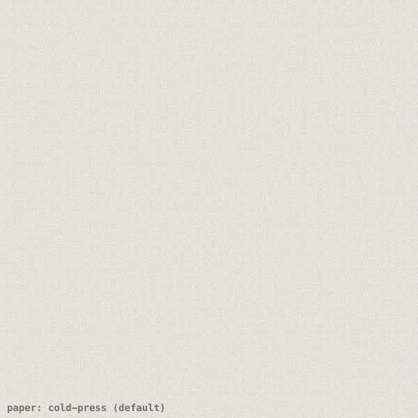
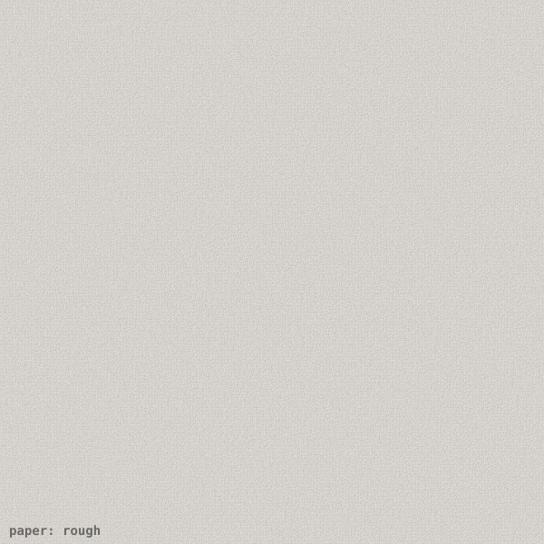
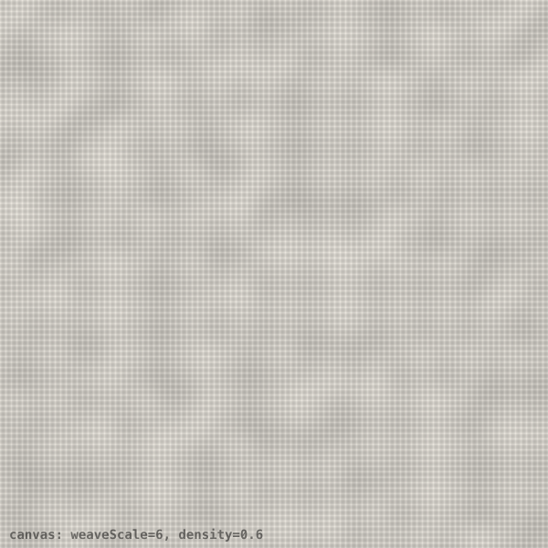
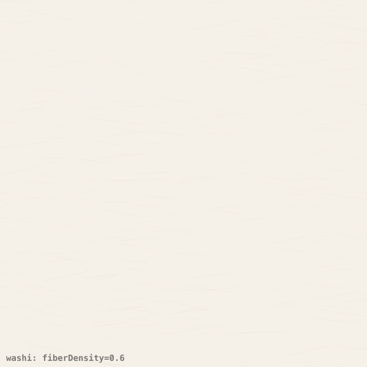
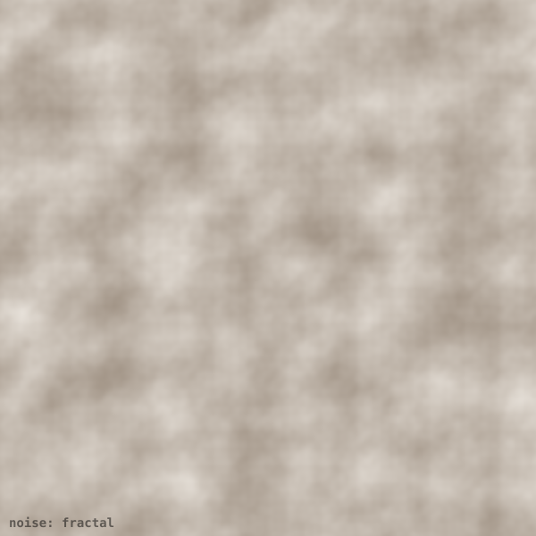
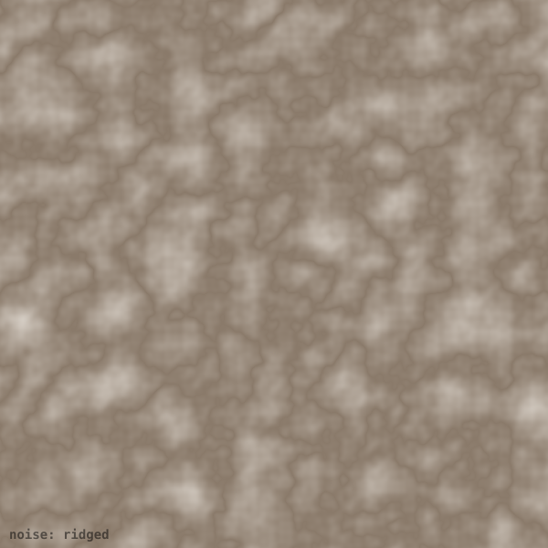

# @genart-dev/plugin-textures

Procedural surface texture layer plugin for [genart.dev](https://genart.dev) — add paper, canvas, washi, and noise textures beneath or over any sketch. All textures are generated procedurally at render time — no external assets required. Includes MCP tools for AI-agent control.

Part of [genart.dev](https://genart.dev) — a generative art platform with an MCP server, desktop app, and IDE extensions.

## Install

```bash
npm install @genart-dev/plugin-textures
```

## Usage

```typescript
import texturesPlugin from "@genart-dev/plugin-textures";
import { createDefaultRegistry } from "@genart-dev/core";

const registry = createDefaultRegistry();
registry.registerPlugin(texturesPlugin);

// Or access individual layer types
import {
  paperLayerType,
  canvasLayerType,
  washiLayerType,
  noiseTextureLayerType,
  textureMcpTools,
} from "@genart-dev/plugin-textures";
```

## Texture Layers (4)

All texture layers cover the full canvas and are composited with a configurable blend mode and opacity, typically placed beneath the sketch algorithm output.

### Paper Texture (`textures:paper`)

Simulates watercolor or drawing paper with multi-octave fractal noise grain. Four presets cover common paper types.

| Property | Type | Default | Description |
|----------|------|---------|-------------|
| `preset` | select | `"cold-press"` | `"smooth"`, `"cold-press"`, `"hot-press"`, `"rough"` |
| `roughness` | number | *(preset)* | Grain strength override (0–1) |
| `grainScale` | number | *(preset)* | Noise scale override |
| `color` | color | `"#f5f0e8"` | Paper base color |
| `opacity` | number | `1` | Layer opacity (0–1) |
| `blendMode` | select | `"multiply"` | Canvas blend mode |

**Presets:**

| Preset | Character |
|--------|-----------|
| `smooth` | Fine grain, minimal tooth |
| `cold-press` | Medium grain — most versatile (default) |
| `hot-press` | Slightly rough, pressed finish |
| `rough` | Heavy grain, prominent tooth |

### Canvas Texture (`textures:canvas`)

Simulates stretched artist's canvas with an interlocked weave pattern.

| Property | Type | Default | Description |
|----------|------|---------|-------------|
| `weaveScale` | number | `6` | Weave thread spacing in pixels (1–20) |
| `density` | number | `0.6` | Thread density (0–1) |
| `roughness` | number | `0.4` | Weave irregularity (0–1) |
| `color` | color | `"#f0ece4"` | Canvas base color |
| `opacity` | number | `1` | Layer opacity (0–1) |
| `blendMode` | select | `"multiply"` | Canvas blend mode |

### Washi Paper (`textures:washi`)

Simulates Japanese washi paper with visible, semi-random fiber strands.

| Property | Type | Default | Description |
|----------|------|---------|-------------|
| `fiberDensity` | number | `0.5` | Number of visible fibers (0–1) |
| `fiberLength` | number | `80` | Average fiber length in pixels (20–200) |
| `color` | color | `"#f5f0e8"` | Base paper color |
| `seed` | number | `0` | Random seed for fiber placement |
| `opacity` | number | `1` | Layer opacity (0–1) |
| `blendMode` | select | `"multiply"` | Canvas blend mode |

### Noise Texture (`textures:noise`)

General-purpose noise texture. Three noise algorithms with two-color mapping for stylized effects (grain, fog, grunge, organic surfaces).

| Property | Type | Default | Description |
|----------|------|---------|-------------|
| `type` | select | `"fractal"` | `"value"`, `"fractal"` (fBm), `"ridged"` |
| `scale` | number | `80` | Noise feature scale in pixels (1–200) |
| `octaves` | number | `4` | Fractal octave count (1–6, fractal/ridged only) |
| `colorA` | color | `"#ffffff"` | Color mapped to low noise values |
| `colorB` | color | `"#000000"` | Color mapped to high noise values |
| `seed` | number | `0` | Noise seed |
| `opacity` | number | `1` | Layer opacity (0–1) |
| `blendMode` | select | `"normal"` | Canvas blend mode |

## MCP Tools (4)

Exposed to AI agents through the MCP server when this plugin is registered:

| Tool | Description |
|------|-------------|
| `add_paper_texture` | Add a paper texture layer (with optional preset) |
| `add_canvas_texture` | Add a canvas weave texture layer |
| `add_washi_texture` | Add a washi fiber paper texture layer |
| `add_noise_texture` | Add a noise texture layer (value, fractal, or ridged) |

## Examples

<table>
<tr>
<td><br><em>Paper — cold press</em></td>
<td><br><em>Paper — rough</em></td>
<td><br><em>Canvas weave</em></td>
</tr>
<tr>
<td><br><em>Washi paper</em></td>
<td><br><em>Noise — fractal (fBm)</em></td>
<td><br><em>Noise — ridged</em></td>
</tr>
</table>

## Related Packages

| Package | Purpose |
|---------|---------|
| [`@genart-dev/core`](https://github.com/genart-dev/core) | Plugin host, layer system (dependency) |
| [`@genart-dev/plugin-painting`](https://github.com/genart-dev/plugin-painting) | Painting layers — pair with paper/canvas texture underneath |
| [`@genart-dev/mcp-server`](https://github.com/genart-dev/mcp-server) | MCP server that surfaces plugin tools to AI agents |

## Support

Questions, bugs, or feedback — [support@genart.dev](mailto:support@genart.dev) or [open an issue](https://github.com/genart-dev/plugin-textures/issues).

## License

MIT
